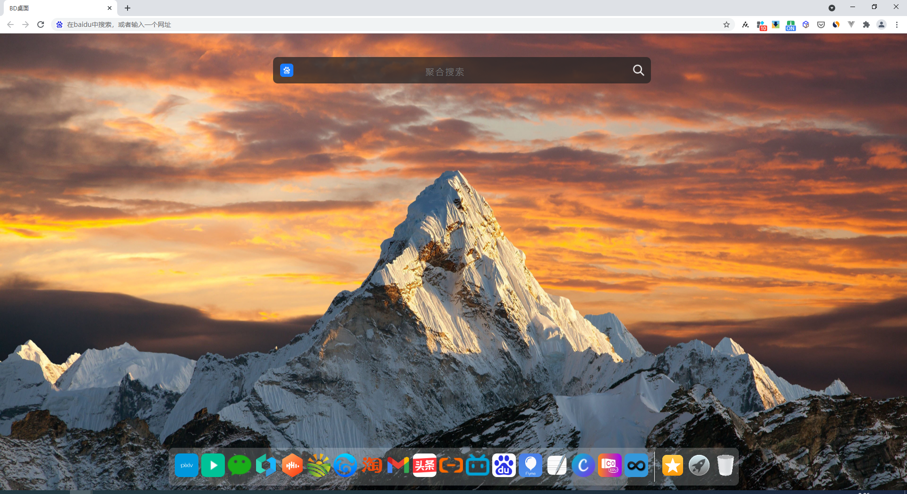
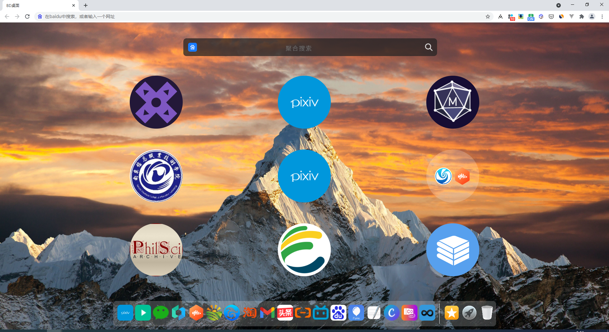
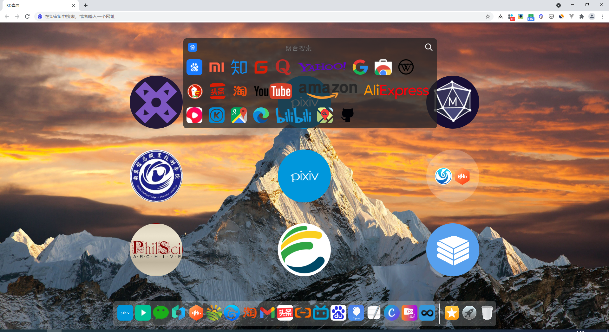
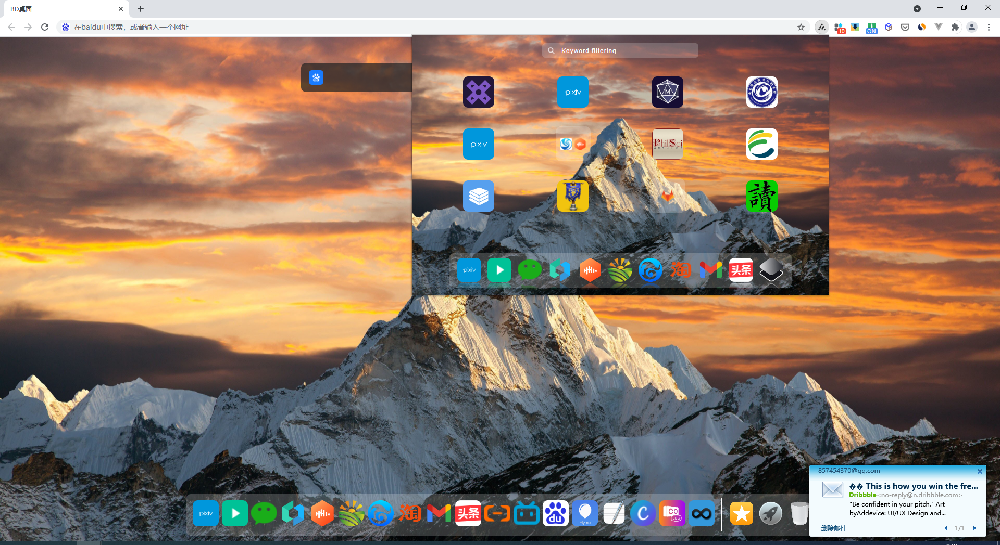
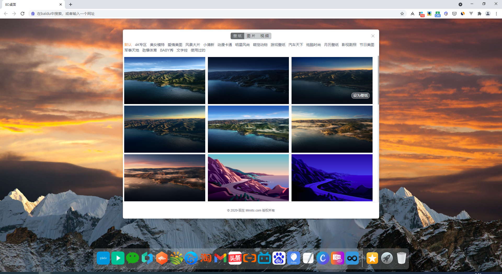

# chrome newtab Expand

#### 浏览器必装插件
非常实用的chrome新标签页:Browser Desktop新标签页 
- 全网最好用的新标签页插件，没有之一。

官网地址：https://www.miniits.com

推荐理由：

1、高度自定义的主页风格，可以设置成mac OS一样的风格，

2、高效的聚合搜索，内置70+个搜索源，还可以自定义搜索源，

3、小窗口功能，

4、书签同步、

5、标签同步

6、一键高效收藏文本和图片等
.
.
.

#### 安装

1.  在线安装地址：https://chrome.google.com/webstore/detail/browser-desktop/dnalhngfejihcbdpdeppfjimkjgeggoc/reviews

2.  离线安装地址：https://www.miniits.com

### 预览图

